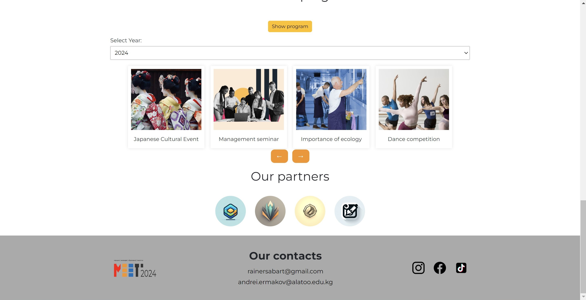
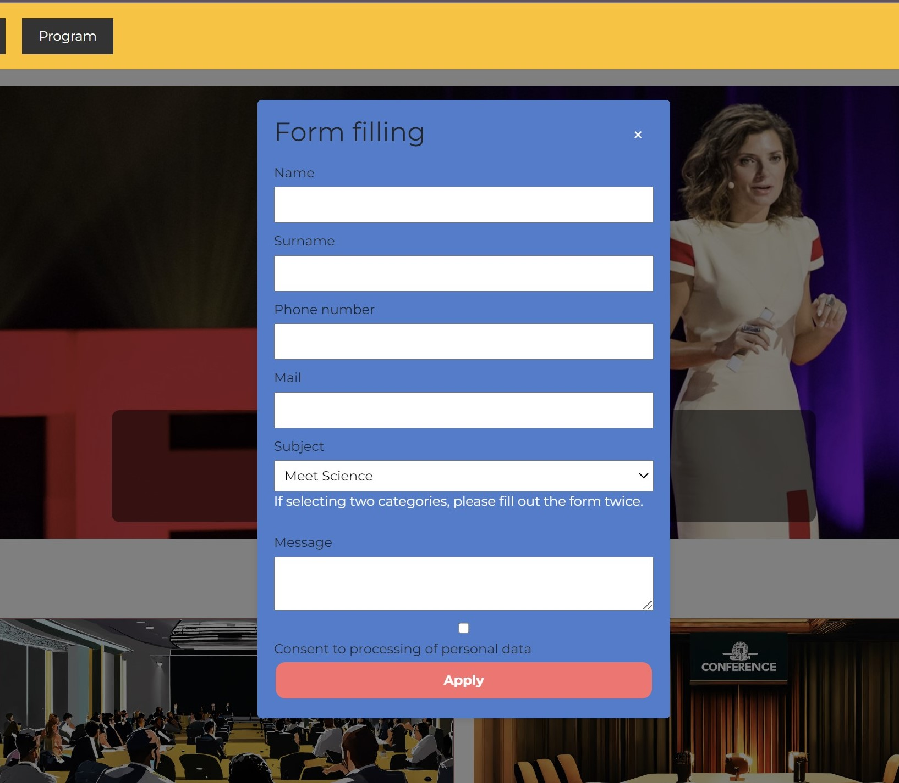

# Meet Conference Website

This project is part of my Industrial Internship, designed to create a platform for organizing events, seminars, and learning discoveries.

## Team

- **Name:** Taalaibekov Emir
- **ID:** 210104025
- **Group:** Com21 A-group
- **Position:** Frontend Developer

## Tools

- **Design:** Figma
- **Framework:** Bootstrap
- **Languages:** HTML, CSS, JavaScript

## Project Description

The Meet Conference Website is designed to facilitate the organization and management of various events, seminars, and learning activities. It provides users with an interactive and engaging platform to discover and participate in these events.

### Last Modified: 05.06.2024

#### Recent Updates:

- **Animations:** Added animations for navigation elements and entities.
- **Text Sizes:** Adjusted text sizes for better readability.
- **Gallery & Footer:** Reworked the gallery section and improved the footer design.

## Installation & Setup

To view the site correctly, follow these steps:

1. **Clone the repository:**
    ```sh
    git clone https://github.com/Emir339/Meet.website.git
    ```
2. **Open the folder in VS Code:**
    ```sh
    cd meet-conference-website
    code .
    ```
3. **Install Live Server extension:**
    - Go to the Extensions view by clicking the Extensions icon in the Sidebar or pressing `Ctrl+Shift+X`.
    - Search for "Live Server" and install it.
4. **Launch Live Server:**
    - Right-click on the `index.html` file.
    - Select "Open with Live Server".

### Note

To enable data submission and request forms, ensure to connect the code to a backend server.

## Preview






### Important Note

GitHub Pages may incorrectly load files, or the author may not have configured the loading correctly. We highly recommend manual installation to fully verify the functionality and design.
